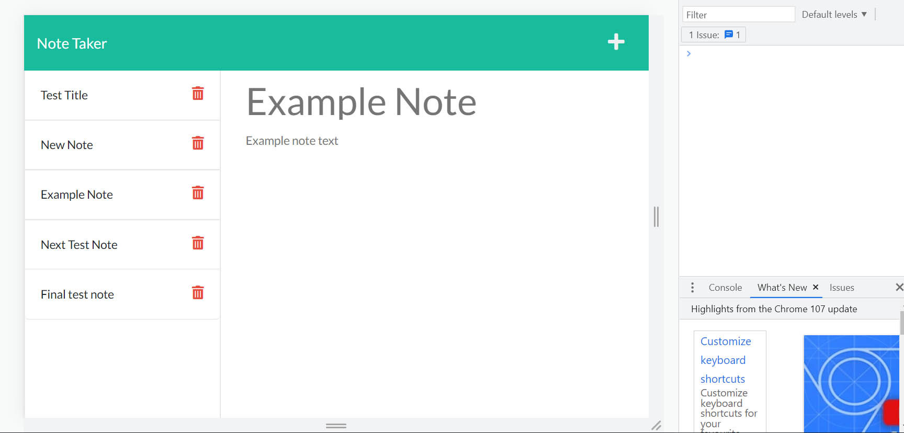

# Week Eleven Challenge: Note Taker

## Description

This repository is where I refactor starter code to create an app to store and create new notes.

## Installation

N/A

## Usage

Open the webpage to view the Note Taker app. Existing notes will appear in the left hand column and can be clicked to view in the right hand text area. To clear an existing note from the right hand view and add a new note, click the plus icon in the navigation bar. Start typing your note title and note text and the save icon will appear. Click the save icon to save the content of your note, and it will appear in the left hand column of existing notes. Existing notes can be permanently deleted by clicking the delete icon next to the note name in the left hand column.

Link to deployed app: (https://bechedley-note-taker.herokuapp.com/)

## Credits

Starter code provided by Monash University.

The following resources were referenced to ensure best practice and adherence to appropriate conventions:

uuid npm documentation: (https://www.npmjs.com/package/uuid)

Express.js npm documentation: (https://www.npmjs.com/package/express)

## License

Licensed under the standard MIT license. Please refer to the license in the repo for more information.